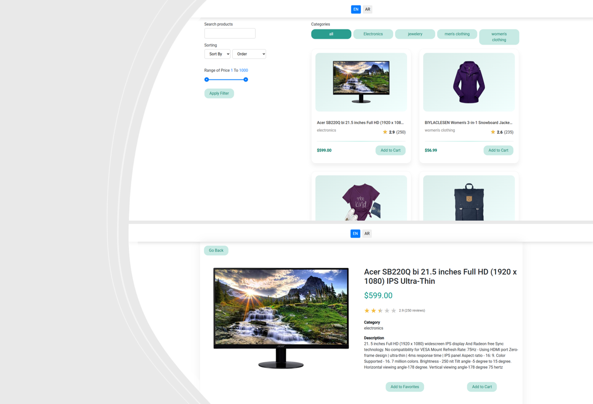

# Product Dashboard
This project was generated using [Angular CLI](https://github.com/angular/angular-cli) version 15.2.0.

## Overview
This is an Angular-based Product Dashboard application that allows users to browse products, filter and sort them, manage favorites, and handle a shopping cart. The project is built with NgRx for state management, supports i18n (internationalization), and includes performance optimizations.



### Live Demo

A live demo of the Product Dashboard is available. The project has been built using Angular's production build (`ng build`) and deployed via GitHub Pages.  
You can view the full UI and interact with the features using the following link: [View Demo](https://mahmoudprog.github.io/product-dashboard-demo/products)

---

## Table of Contents
1. [Setup Instructions](#setup-instructions)  
2. [Architecture & State Management](#architecture--state-management)  
3. [i18n Setup & Performance Optimizations](#i18n-setup--performance-optimizations)  
4. [Possible Improvements](#possible-improvements)  

---

## Setup Instructions
Follow these steps to set up and run the project locally:

### 1. Prerequisites
Make sure you have installed the following:
- [Node.js](https://nodejs.org/) (v18+ recommended)
- [npm](https://www.npmjs.com/) (comes with Node.js)
- Angular CLI (v15+)
```bash
npm install -g @angular/cli
npm install
```
### 2. Development server

To start a local development server, run:

```bash
ng serve
```
Once the server is running, open your browser and navigate to `http://localhost:4200/`. The application will automatically reload whenever you modify any of the source files.
### 3. Running unit tests

To execute end-to-end tests with [Cypress](https://www.cypress.io), use the following command:

```bash
ng test
```

## Architecture & State Management

The Product Dashboard project follows a **modular Angular architecture** with a clear separation of concerns:

- **Core Module**: Contains singleton services and global utilities used across the app.
- **Shared Module**: Contains reusable components, directives, and pipes.
- **Features Modules**: Each feature (e.g., Products, Cart) has its own module with components, services, and state management setup.
- **App Module**: Root module that ties everything together.

### State Management

The application uses **NgRx** for centralized state management. All key data, such as products, shopping cart, selected filters, and categories, is stored in the **NgRx Store**.  

Key concepts:

- **Store**: The single source of truth for the application's state.
- **Actions**: Events that trigger state changes, e.g., `loadProducts`, `addToCart`.
- **Reducers**: Pure functions that calculate the next state based on the current state and dispatched actions.
- **Selectors**: Functions that read and return specific slices of the state, making it easy for components to access needed data.
- **Effects**: Handle side effects such as API calls, keeping components clean and focused only on presentation.

This setup allows:

- Consistent and predictable state across the app.
- Easy communication between components without `@Input`/`@Output`.
- Improved performance since Angular re-renders only affected components.
- Scalable architecture suitable for large applications.


### Project Structure
You can see the full project structure in [STRUCTURE.txt](./STRUCTURE.txt)


## i18n Setup & Performance Optimizations

### Internationalization (i18n)

The Product Dashboard supports multiple languages using **@ngx-translate/core**:

- **Translation Files**: Stored in `assets/i18n/` as JSON files, e.g., `en.json`, `ar.json`.
- **TranslateModule**: Imported in the root module to provide translation services app-wide.
- **Usage in Components**: Use the `| translate` pipe to display translated text, e.g., `{{ 'SEARCH_PRODUCTS' | translate }}`.
- **Dynamic Language Switching**: Users can change the language at runtime, and the UI updates instantly.

### Performance Optimizations

Several optimizations are applied to ensure smooth performance:

1. **OnPush Change Detection**: Components use `ChangeDetectionStrategy.OnPush` wherever possible to reduce unnecessary re-renders.
2. **TrackBy in *ngFor**: Improves performance for lists by letting Angular know which items changed.
3. **Lazy Loading of Feature Modules**: Only loads feature modules when needed, reducing initial bundle size.
4. **Memoized Selectors in NgRx**: Using `createSelector` ensures state slices are only recalculated when relevant state changes.
5. **HTTP Caching for API Calls**: Frequently fetched data, like product details, are cached in services to reduce network calls.
6. **Async Pipe**: Handles subscriptions automatically and avoids memory leaks.

### i18n Flow & HTTP Caching
You can see the ASCII diagram for i18n, HTTP Caching in [i18n.txt](./i18n.txt)


### Performance Optimizations

This project includes several performance optimizations to ensure smooth and efficient user experience:

- **Change Detection Strategy**: Components use Angular’s `OnPush` strategy to minimize unnecessary re-renders, improving rendering performance.  
- **TrackBy in *ngFor***: All repeated elements use `trackBy` functions to avoid re-rendering the entire list when only some items change.  
- **Lazy Loading Modules**: Feature modules are loaded lazily, reducing initial bundle size and improving startup time.  
- **HTTP Caching**: API responses are cached in services (e.g., `ProductService`) to prevent redundant HTTP calls and reduce network load.  
- **Optimized Observables**: RxJS streams are optimized with operators like `debounceTime` and `distinctUntilChanged` to reduce unnecessary state updates during user interactions.  
- **Skeleton Loaders**: Loading states are handled with lightweight skeleton components to enhance perceived performance while data is fetched.  

These strategies collectively enhance responsiveness, reduce memory consumption, and provide a smoother user experience across the application.


### Possible Improvements

Although the current implementation of the Product Dashboard is fully functional, there are several potential improvements that could enhance the application:

- **Advanced Filtering and Sorting**: Implement more sophisticated filters and multi-criteria sorting options.  
- **Virtual Scrolling**: Optimize rendering for large product lists using virtual scrolling to reduce DOM load.  
- **Enhanced UI/UX**: Improve the interface with animations, better responsiveness, and user-friendly design patterns.  
- **Extended i18n Support**: Add support for more languages and streamline translation workflows.  
- **Security Enhancements**: Strengthen authentication, authorization, and API security measures.  
- **Testing Coverage**: Expand unit tests, selectors, and E2E tests to cover more edge cases.  
- **Performance Monitoring**: Integrate tools to monitor runtime performance and detect bottlenecks.  
- **Firebase Integration**: Consider using Firebase for real-time updates, such as live product inventory changes or cart synchronization across devices.
- Implement page numbering in the pagination component to improve user navigation through multiple pages of products.


These improvements provide a roadmap for future iterations, ensuring the application remains scalable, efficient, and user-friendly.


---

### Conclusion

The Product Dashboard project demonstrates a scalable, maintainable, and user-friendly Angular application.  
It highlights best practices in state management with NgRx, internationalization (i18n), and performance optimization.  
Feel free to explore, test, and contribute to enhance the project further.
